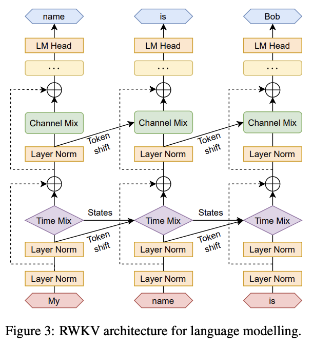

::: tip
If you are not not familiar machine learning, I would highly recommend [Andrej Karpathy series on neural networks](https://www.youtube.com/watch?v=VMj-3S1tku0&list=PLAqhIrjkxbuWI23v9cThsA9GvCAUhRvKZ&ab_channel=AndrejKarpathy) - that would help provide a good foundation on various neural network architectures concepts.
:::

## What is hiddenstate / channel / time mixing, explain it in simple terms?

In its simplest form, RWKV processes one token at a time, and update a "hidden state" which consist of a large vector of floating point numbers. This hidden state is used to generate the next token, and represents the model current "state of mind".

When performing a standard AI completion of the next token. This "hidden state" will be generated using the model pverious "hidden state".

Channel mixing is the process where the next token being generated is mixed with the previous state, to update this "state of mind". In general channel mixing contains data from the most recent tokens. As the model loops through the process, token by token (see the diagram)

Time mixing is a similar process, but it allows the model to retain part of the previous state of mind over a longer period of time. Which is trained by the model. This allow it to retain data from the past indefinitely, if it was trained to do so.

Because the current token, is able to read data from the past state via channel and time mixing. This provides an alternative to "attention" models. 

This is done using key information is stored in the hidden state (decided by the model weights), across the various layers, and is read against the current state. Effectively providing a form of "trained attention" of the past tokens (stored inside the hidden state), against the current token.

> PS: the above is an inaccurate oversimplification, read the paper / links below for deeper details

## I want the nitty-gritty, where do I find it?

A good starting point, is to look into [RWKV in 150 lines of code](https://github.com/BlinkDL/ChatRWKV/blob/main/RWKV_in_150_lines.py), which is a good starting point to understand the core concepts of RWKV. You can find the 150 lines explained in more details at the following [blog post here](https://johanwind.github.io/2023/03/23/rwkv_details.html)

Alternatively, you can study it up via the [RWKV paper](https://arxiv.org/abs/2305.13048)
Or watch [Yannic Kilcher break the paper down step by step on youtube](https://www.youtube.com/watch?v=x8pW19wKfXQ&pp=ygUEUldLVg%3D%3D)

If you would like a breakdown on the math involved, you can find it covered in a blog post here: [https://ben.bolte.cc/rwkv](https://ben.bolte.cc/rwkv)

Once you gotten a grasp on the fundemantals, you can start studying the training and cuda code respectively in the [main repo](https://github.com/BlinkDL/RWKV-LM)
